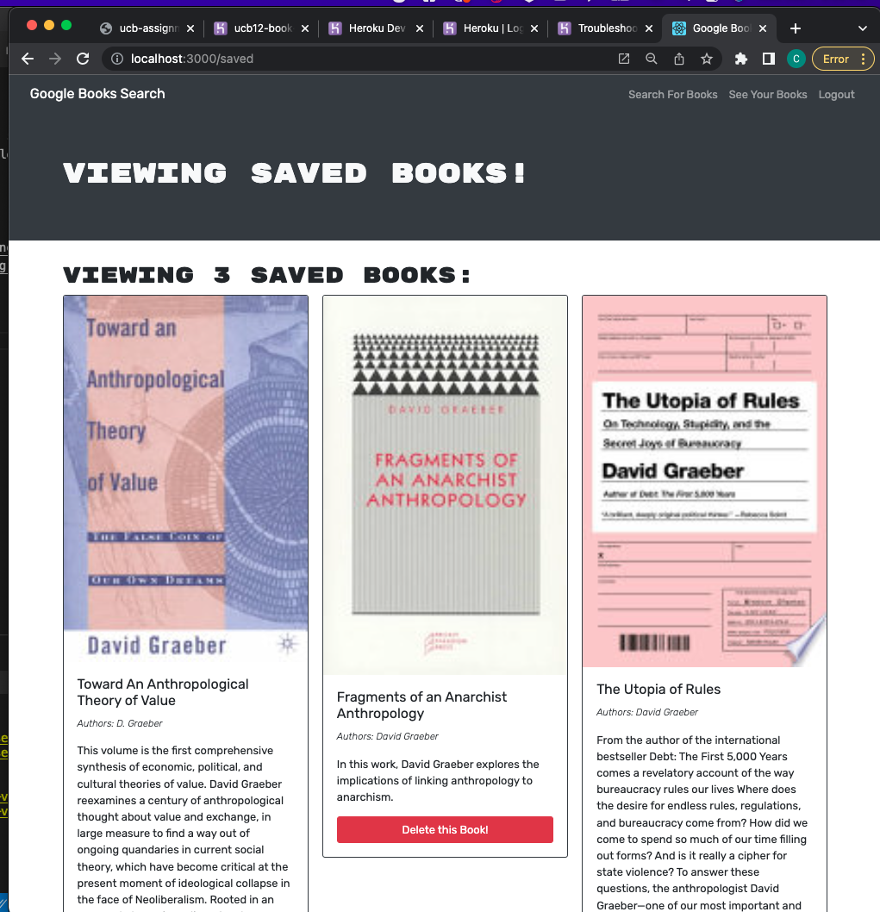
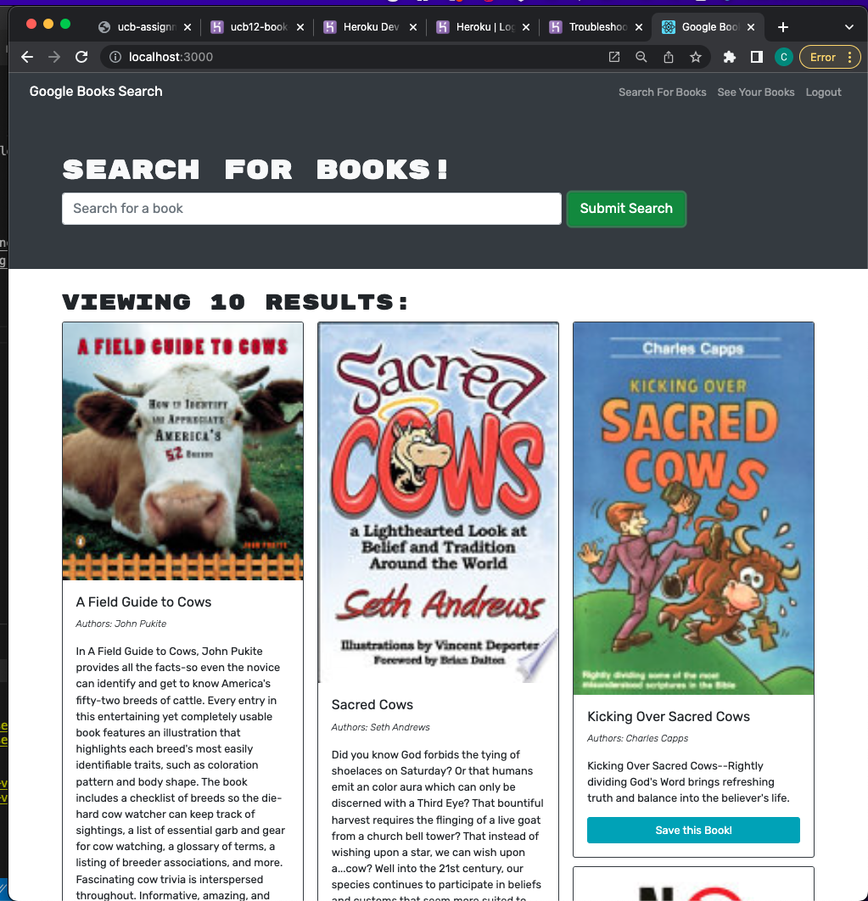

# UCB Assignment 21 -- Book Search Engine
This is the final individual assignment for UCB's full stack development program. The associated application allows a user to sign up, login in/out, and to search books and save them through Apollo/graphQl. This assignment was completed by Cassie Kise.

## Links
https://github.com/cassandrakise/ucb-assignment-21-book-search-engine
https://cassandrakise.github.io/ucb-assignment-21-book-search-engine/
https://ucb12-book-search.herokuapp.com/

## Images
- 
- 